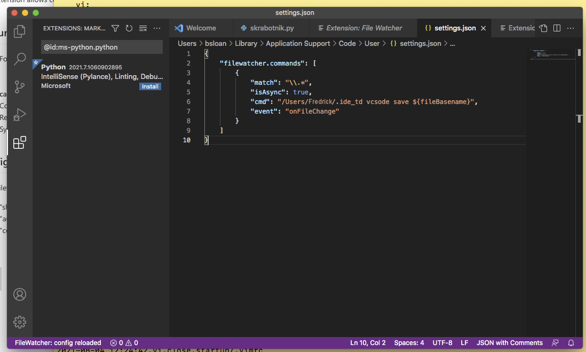

TimeDonkey
==========

A very humble framework for tracking time spent in various applications  
-----------------------------------------------------------------------

I spend most of my time at work using a handful of applications and often find myself 
at the end of the week wondering what the heck I was doing for the past 5 days. This little 
set of scripts is an attempt to clear up some of the mystery. The trick is to customize
the most frequently used applications' startup scripts. In my case, these are $(HOME)/.vimrc and $(HOME)/.nuke/menu.py.
The customizations cause certain events (file-open, file-save, file-close) to save a record to a user-owned time-logging
database file. Each record contains a human-readable timestamp, application, action (open, save, close) and an arg -- usually
the name of a file being edited or modified in some way. 

A simple script for summarizing one's time provides output that can be understood by non-technical bean counters. 

Here's an example of a few moments' worth of database records...

```
2021-07-23 16:59:52,vi,open,python/summary.py
2021-07-23 17:10:33,vi,save,python/summary.py
2021-07-23 17:10:33,vi,close,python/summary.py
2021-07-23 17:23:01,nuke,open,Root
2021-07-23 17:25:02,nuke,save,ilut_for_resolve_generator.nk
2021-07-23 17:25:56,nuke,save,ilut_for_resolve_generator.nk
2021-07-23 17:29:29,vi,open,python/summary.py
2021-07-23 17:29:56,vi,save,python/summary.py
2021-07-23 17:29:56,vi,close,python/summary.py
2021-07-23 17:30:05,vi,open,python/summary.py
2021-07-23 17:37:27,nuke,save,ilut_for_resolve_generator.nk
2021-07-23 17:41:57,vi,open,ascii_to_ilut.py
2021-07-23 17:51:01,vi,save,ascii_to_ilut.py
2021-07-23 17:51:01,vi,close,ascii_to_ilut.py
2021-07-23 17:51:18,vi,open,ascii_to_ilut.py
2021-07-23 17:51:25,vi,save,ascii_to_ilut.py
2021-07-23 17:51:25,vi,close,ascii_to_ilut.py
```

And here is the output of summary.py for a longer stretch of records...
```
Fri Jul 23:
    vi:
         2h python/summary.py
        0.5h ascii_to_ilut.py
        0.5h README.md
    nuke:
         1h ilut_for_resolve_generator.nk
```

Getting Started
---------------
To get up-and-running with any of the supported applications, follow the application-specific instructions below


VIM
---
Append the following lines to your .vimrc file (usually in the root of your home directory)
```
" TimeDonkey vim plugin
function SaveRecord(app, action)
    let com = "echo `date +\"%Y-%m-%d %H:%M:%S\"`," . a:app . "," . a:action . "," . @% . " >> ~/.activitylog"
    call system(com)
    return 0
endfunction

" Events that call TimeDonkey::SaveRecord
autocmd BufWinEnter * call SaveRecord('vi', 'open')
autocmd BufWritePost * call SaveRecord('vi', 'save')
autocmd BufWinLeave * call SaveRecord('vi', 'close')
```

This snippet can be found in this repository in startup/.vimrc. 


Nuke
----
Nuke looks for a startup file called menu.py in a .nuke/ directory in the users home/ directory. Adding the following lines will
track file opens, saves and closes in Nuke:
```
# this is a python startup script that will be run automatically 
# when Nuke (https://learn.foundry.com/nuke/13.0/content/learn_nuke.html) 
# is launched


import os
import datetime
import nuke


def save_record(app, action):
    """
    Save a time-stamped event in the users TimeDonkey activity log.  
    """
    current = datetime.datetime.now()
    timestr = current.strftime("%Y-%m-%d %H:%M:%S")
    if nuke.root().name() == 'Root' or action == 'save':
        with open('{0}/.activitylog'.format(os.getenv('HOME')), 'a') as handle:
            handle.write(timestr + ',' + app + ',' + action + ',' + os.path.basename(nuke.root().name()) + '\n')
        

save_record('nuke', 'open')
nuke.addOnScriptSave(save_record, args=('nuke', 'save'))
nuke.addOnScriptClose(save_record, args=('nuke', 'close'))

```
This snippet can be found in this repository in startup/menu.py. 

PyCharm
-------

For Pycharm users you'll need to add a File Watcher. Here's an illustration of how that will 
look in Pycharm preferences:


Be sure to set the correct path to the file ".ide_td". In the example, it resides in the root of your home directory.
In this repository, .ide_td lives with the other startup scripts in the startup/ directory. Feel free to move it wherever you 
please but make sure it matches the path set in PyCharm preferences.

VSCode
------

VSCode has an extension called FileWatcher that must first be installed. Here's an illustration of how that will 
look in VSCode extensions (editing the settings.json by hand):
In this repository, .ide_td lives with the other startup scripts in the startup/ directory.



Be sure to set the correct path to the file ".ide_td", to wherever you've installed it.

The Catch
---------

There's a requirement that one's favorite applications must have "hooks" that allow user-defined actions
to be associated with certain events. Graphical IDEs like Pycharm, VisualStudio and XCode must allow custom actions on, say, file-changed
or viewed-file-changed events in order for them to work.

I believe systems that use Xorg windowing system have a way to monitor the window that is currently in focus. Though
that might not be too useful.

For those who spend a lot of time in git repositories (as I do) there may be a way to use global event hooks to
do something similar to what I'm doing in .vimrc.
